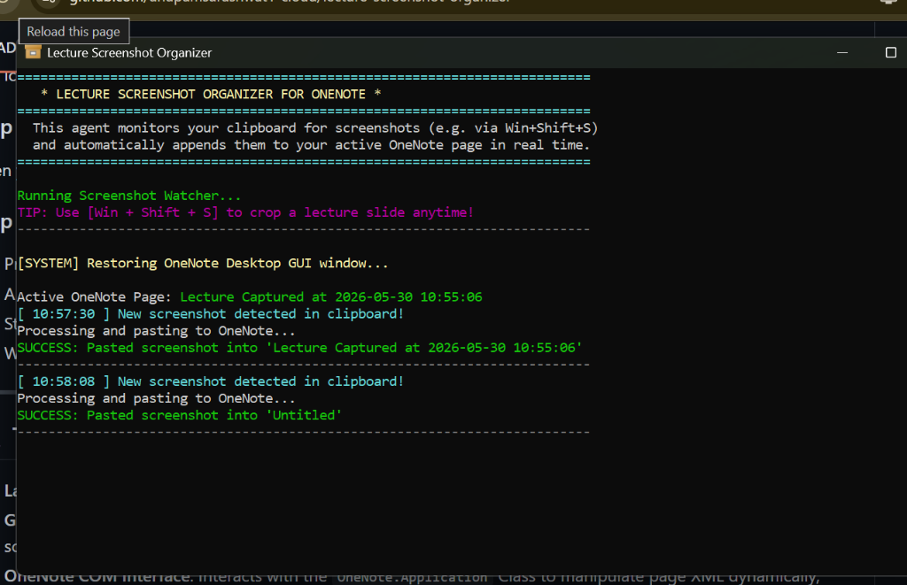

# 🎓 Lecture Screenshot Organizer for OneNote

A lightweight, zero-dependency background automation agent built for Windows. It lets you take cropped screen snips (`Win + Shift + S`) during active lectures and automatically pastes them into your active Microsoft OneNote Desktop page in real-time—complete with timestamps and zero-focus disruption!



---

## 💡 The Story & Philosophy

> "I am a **VLSI Engineer** preparing for the **UPSC** (Union Public Service Commission)."

When attending highly dense lectures, reading heavy textbooks, or watching academic videos for the first time, we often run into a common cognitive trap:

1. **The Focus Dilemma**: If we try to write detailed, comprehensive notes *during* the first reading/viewing, our active concentration on the subject matter is severely broken.
2. **The Bulkiness Trap**: Trying to make notes concurrently leads to bulky, disorganized, and poor-quality summaries because we haven't digested the full context yet.
3. **The Forgetfulness Trap**: If we just listen without making notes, we quickly forget most of the content shortly after.

### 🌟 The Solution
This tool was built to solve this exact problem:
* **During the Lecture**: Keep 100% of your focus on actively listening and understanding the material. Whenever a critical slide, diagram, or formula appears, simply crop-snip it (`Win + Shift + S`). 
* **The Automation**: The background agent instantly captures the screenshot from your clipboard and inserts it vertically into your OneNote page in the background.
* **Post-Lecture Compilation**: Once the lecture is completed, open your OneNote where all your captures are beautifully lined up. You can now cleanly, quietly, and thoughtfully compile high-quality, concise, and highly effective revision notes!

---

## ✨ Key Features

* **Instant Clipboard Watcher**: Automatically detects any new image copied to the clipboard.
* **100% Silent Background Pasting**: Inserts screenshots directly into your page XML without bringing OneNote to the front or stealing focus.
* **Dynamic Page Scanner**: If OneNote is minimized or out of focus, the agent automatically scans your notebook structures in milliseconds to find your **most recently modified page** and appends it there!
* **Active Window Auto-Restoration**: If the OneNote GUI is closed or running headlessly, the script uses Microsoft's native `NavigateTo` COM API to instantly restore the window and jump straight to the page where it is pasting.
* **Smart Order Stacking**: Automatically stacks images vertically in a single column so they never overlap or clutter.
* **Global Windows Hotkey**: Press **`Ctrl + Alt + O`** from anywhere on your PC to launch the agent instantly.

---

## 🛠️ Repository Directory Structure

```text
LECTURE SCREENSHOT ORGANIZER AGENT/
│
├── Start-ScreenshotOrganizer.ps1  # The core PowerShell automation script
├── Start-ScreenshotOrganizer.bat  # Double-click launcher to run the script
├── Create-Shortcut.ps1            # Set up the Desktop shortcut and global hotkey
├── .gitignore                     # Ignores temporary logs
└── diagnostics/
    └── test_onenote.ps1           # Diagnoses COM and Notebook connection states
```

---

## 🚀 Installation & Setup

### Prerequisite
This tool requires the standard **Microsoft OneNote Desktop** app (included with Office 365, or downloadable for free from `onenote.com/download`). 

*Note: The deprecated "OneNote for Windows 10" Microsoft Store app is not supported because it lacks Windows COM automation.*

### Step 1: Create the Desktop Shortcut & Hotkey
1. Open your workspace directory.
2. Right-click **`Create-Shortcut.ps1`** and select **Run with PowerShell** (or run it from a terminal).
3. This will create a shortcut named `OneNote Screenshot Organizer` right on your **Windows Desktop** with a camera icon and bind it to the global hotkey **`Ctrl + Alt + O`**.

### Step 2: Open OneNote Desktop
Open your OneNote Desktop app and navigate to (or create) the page where you want to paste your lecture slides.

### Step 3: Launch & Capture!
1. Press **`Ctrl + Alt + O`** on your keyboard (or double-click the Desktop shortcut).
2. A sleek command prompt window will open, confirming it is watching your clipboard.
3. Start watching your lecture! Press **`Win + Shift + S`** to crop-snip any part of your screen.
4. Watch the slides instantly organize themselves on your OneNote page in the background!

---

## 🔍 Technical Implementation Details

* **Language**: Native Windows PowerShell (v5.1+) / .NET Interop.
* **Graphics Handling**: Utilizes `System.Drawing.Imaging` to hash clipboard bitmaps using MD5, ensuring only *new* screenshots are pasted.
* **OneNote COM Interface**: Interacts with the `OneNote.Application` Class to manipulate page XML dynamically, automatically resolving different version namespaces on the fly.
